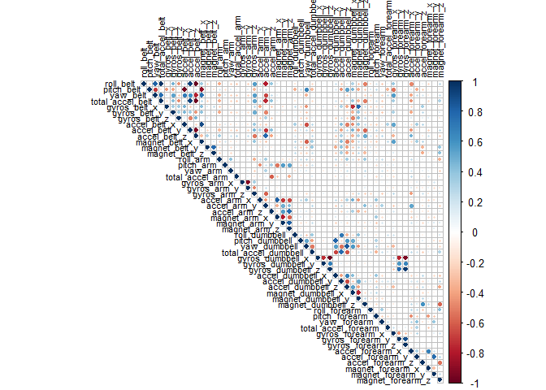

Applied Machine Learning on the Human Activity Recognition Dataset
================
KennethFajardo
06/01/2021

# Overview

A study conducted by Ugulino et al. (2012) on predicting the manner by
which a participant performs bicep curls, based from the recordings
found using experimental wearable devices. The exercise is performed
separately while (A) **sitting**, (B) **sitting down**, (C)
**standing**, (D) **standing up**, or (E) **walking**. The activities
are denoted by the variable `classe`, which is a factor ranging from A
to E. The goal of this project is to use machine learning and find the
best ML model/s that would help predict `classe`.

# Getting and Cleaning Data

## Initialization

Load the needed packages.

``` r
library(caret) # main package (comes with ggplot2 and lattice)
library(rattle) # for visualizing decision trees
library(corrplot) # for predictor selection
```

Download and read the data.

``` r
download.file("https://d396qusza40orc.cloudfront.net/predmachlearn/pml-training.csv", "training.csv")
download.file("https://d396qusza40orc.cloudfront.net/predmachlearn/pml-testing.csv", "testing.csv")
```

``` r
training <- read.csv("training.csv")
testing <- read.csv("testing.csv")
dim(training)
```

    ## [1] 19622   160

# Preprocessing the data

After examining the data using the `View()` function, we can see that
the data has a lot of missing values. Hence, we must first impute the
columns with a lot of missing data i.e. columns with total missing
values greater than 10% of each respective column.

``` r
nrows <- nrow(training)
training <- training[, colSums(is.na(training)) <= 0.1*nrows]
```

To further clean the training data, we can remove metadata including the
time factor since it is not needed for predicting `classe`, and those
with near zero variances.

``` r
# Remove metadata
training <- training[, -c(1:7)]
# Remove near zero variances
nzero <- nearZeroVar(training)
training <- training[,-nzero]
dim(training)
```

    ## [1] 19622    53

We have reduced the number of variables from **160 to 53**, and can now
split the clean data into training and validation set.

``` r
inTrain <- createDataPartition(y=training$classe, p=0.7, list=F)
training <- training[inTrain,]
validation <- training[-inTrain,]
```

# Correlation Analysis

Examine the correlations to see which predictors may contribute to
overfitting. We can see that measurements from the belt, arms and arm
extensions are key factors in determining the current activity. Note
that measurements from legs and feet were removed due to missing values.

``` r
corMat <- cor(training[,-53])
corrplot(corMat, tl.col = "black", type = "upper", tl.cex = 0.7)
```

<!-- -->

``` r
corr <- findCorrelation(corMat, cutoff=0.6)
names(training)[corr]
```

    ##  [1] "accel_belt_z"         "roll_belt"            "accel_belt_y"        
    ##  [4] "accel_arm_y"          "total_accel_belt"     "yaw_belt"            
    ##  [7] "accel_dumbbell_z"     "accel_belt_x"         "pitch_belt"          
    ## [10] "magnet_belt_x"        "accel_dumbbell_y"     "magnet_dumbbell_x"   
    ## [13] "magnet_dumbbell_y"    "total_accel_dumbbell" "accel_forearm_x"     
    ## [16] "accel_dumbbell_x"     "accel_arm_x"          "magnet_dumbbell_z"   
    ## [19] "accel_arm_z"          "magnet_arm_y"         "magnet_belt_y"       
    ## [22] "accel_forearm_y"      "gyros_dumbbell_y"     "gyros_forearm_z"     
    ## [25] "gyros_dumbbell_x"     "gyros_dumbbell_z"     "gyros_arm_x"

# Model Building

The methods we will be using for training are Random Forests, State
Vector Machines and Gradient Boosting Machines with default parameters.
We will be using a 10-fold cross validation for a relatively low bias
and neutral variance.

``` r
# Set seed and training control
set.seed(3123)
control <- trainControl(method="cv", number=10, verboseIter=F)
# Actual training
mod_rf <- train(classe~., method="rf", trControl=control, data=training)
mod_svm <- train(classe~., method="svmLinear",  trControl=control, data=training, verbose=FALSE)
mod_gbm <- train(classe~., method="gbm",  trControl=control, data=training, verbose=FALSE)
```

# Prediction

We, then, predict `classe` in both the validation (in-sample) and
testing (out-of-sample) sets.

``` r
pred_rf <- predict(mod_rf, validation)
pred_svm <- predict(mod_svm, validation)
pred_gbm <- predict(mod_gbm, validation)
```

# Error Rates

Create a confusion matrix for the predictions to observe their accuracy.

``` r
cm_rf<- confusionMatrix(pred_rf, factor(validation$classe))
cm_svm <- confusionMatrix(pred_svm, factor(validation$classe))
cm_gbm <- confusionMatrix(pred_gbm, factor(validation$classe))
```

Summarize the accuracy and out-of-sample errors.

``` r
acc <- rbind(cm_rf$overall['Accuracy'], cm_svm$overall['Accuracy'], cm_gbm$overall['Accuracy'])
oos <- rbind(1-cm_rf$overall['Accuracy'], 1-cm_svm$overall['Accuracy'],
             1-cm_gbm$overall['Accuracy'])
colnames(oos) <- "Out-of-sample Error"
cbind(acc,oos)
```

    ##       Accuracy Out-of-sample Error
    ## [1,] 0.9983010         0.001699029
    ## [2,] 0.7978155         0.202184466
    ## [3,] 0.9682039         0.031796117

We can see that random forests almost has an accuracy of 1, which may be
due to overfitting. GBM yielded a close accuracy of 0.95, and the SVM
produced an accuracy of 0.78. For prediction on the test data, we use
the most accurate fit, which is the random forests.

# Prediction

First, intersect the columns of the training and test sets.

``` r
cnames <- colnames(training)
testNew <- testing[, cnames[-53]]
```

Finally, use the random forests model on predicting `classe` on the test
set.

``` r
pred_rf_test <- predict(mod_rf, testNew)
pred_rf_test
```

    ##  [1] B A B A A E D B A A B C B A E E A B B B
    ## Levels: A B C D E

## References

<div id="refs" class="references">

<div id="ref-wear">

Ugulino, W., Cardador, D., Vega, K., Velloso, E., Milidiu, R., & Fuks,
H. (2012). Wearable computing: Accelerometers’ data classification of
body postures and movements. *Proceedings of 21st Brazilian Symposium on
Artificial Intelligence. Advances in Artificial Intelligence - SBIA
2012*, pp. 52–56. Retrieved from
<http://groupware.les.inf.puc-rio.br/har>

</div>

</div>
